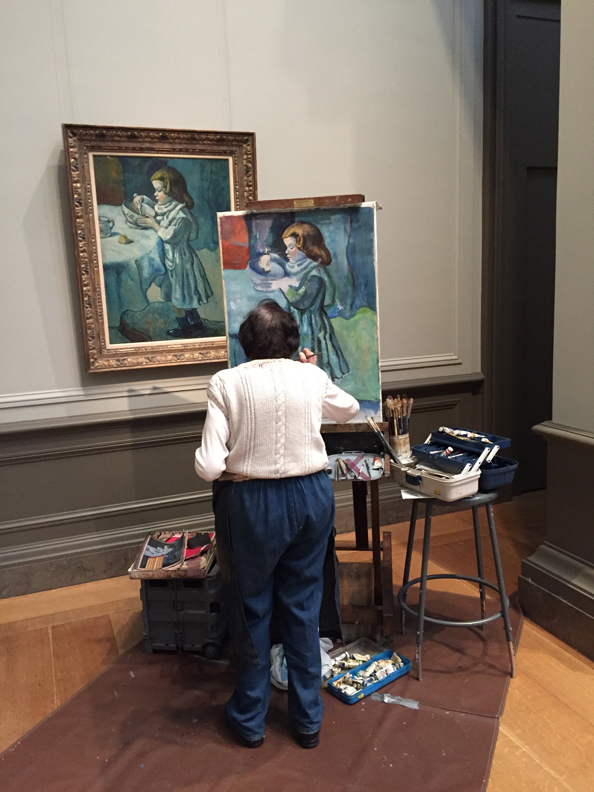

## Cartography
_Feb 23, 2021_  

### Some advice for choosing a region to map  

#### _Think about class pedagogy_  

    - Learn with worked out example  
    - Evidence learning by applying to a new case    

It is often helpful to try to apply new things to a case that is analogous to the worked out example. Think about regions that are analogous to the example in the tutorials. Think about working with datasets that are analogous to the tutorial examples.  

The strongest student work (at introductory level) tends to be largely analogous to the worked out example with a few little twists. In learning theory, this shows evidence of both **near transfer** (analogous application) and **far transfer** (novel application).  

#### _Think about personal interest or familiarity_  

Creative writers often advise their students to 'write what you know', at least for your first novel. In cartography, it is often helpful to try to map a place that you know, or a place that you want to know better.  

Cartography is also a bit of an obsession. It takes time to make a good map and detail matters. So if you are not an obsessive person by nature, it can be helpful to choose a place to map that you have some association or attachment or connection to. This might help make mapmaking something you want to do rather than something you have to do.    

---

### Some vocabulary  

- The straw map argument  
- Reference map  
- Thematic map   

[_Google maps example_](https://www.google.com/maps/@44.0177834,-73.165254,7778m/data=!3m1!1e3)  

  

_Rene Magritte. The Treachery of Images._   

  

_Mark Monmonier. How to Lie with Maps._

  

_Practical cartography. jth._  

### Maps as artifacts  

Two simple reasons that no map represents the "real world":     

1. Scale  
2. Purpose

Unpacking scale:   

  - of map, of data, of subject  
  - of spatial, temporal, subjective, instrumental    

Unpacking purpose:  

- of map maker, map reader, map media  

---

### Learning from examples  

In this course, I aim to teach you a fair amount of technical skills with computer software to make maps, but skills alone will not help you make good maps.  

I also aim to help you look at maps and understand what makes them good.    

  

_Student at National Gallery of Art. jth_  

---

### Learning from historical maps    
 

  

_[The journey through time.](https://map.geo.admin.ch/?topic=swisstopo&X=190000.00&Y=660000.00&zoom=1&lang=en&bgLayer=ch.swisstopo.pixelkarte-farbe&catalogNodes=1392&layers=ch.swisstopo.zeitreihen&time=1864&layers_timestamp=18641231) Swiss topo._

---

  

[_USGS topoView_](https://ngmdb.usgs.gov/topoview/viewer/#11/44.1210/-68.9131)  

---  

  

[_Map of New-York Bay and Harbor And The Environs. 1844. David Rumsey Map Collection._](https://www.davidrumsey.com/luna/servlet/detail/RUMSEY~8~1~2209~180005:Map-of-New-York-Bay-And-Harbor-And-?sort=Pub_List_No_InitialSort%2CPub_Date%2CPub_List_No%2CSeries_No&qvq=w4s:/when%2F1844;q:united%20states%20coast%20survey;sort:Pub_List_No_InitialSort%2CPub_Date%2CPub_List_No%2CSeries_No;lc:RUMSEY~8~1&mi=0&trs=4)  

---  

### Map taxonomy: a style sheet example   

  

[_Nat Slaughter's squirrel atlas_](https://www.davidrumsey.com/luna/servlet/view/search?search=SUBMIT&cat=0&q=squirrel+census&dateRangeStart=&dateRangeEnd=&sort=Pub_List_No_InitialSort%2CPub_Date%2CPub_List_No%2CSeries_No&QuickSearchA=QuickSearchA)  

[Map taxonomy (style guide)](https://drive.google.com/file/d/1p0Ox-xJQyqFM9AxEFRxv2lDZ8fxG9V9W/view?usp=sharing)  

### Check point 1  

By our next lecture meeting on 2/28, please remember to fill out [this form](https://forms.gle/G7BpL8rHCbRtGsvU9) about your project.     
