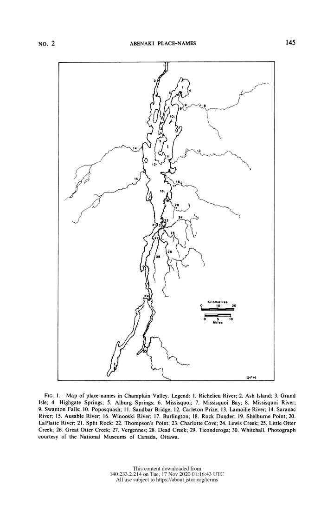

## Place names and map lettering    

_An introduction to the problem of labeling place names on maps, or what some cartographers call **toponymy**._   

### A traditional map dichotomy   

In ["A Place for Stories: Nature, History, and Narrative"](https://www.williamcronon.net/writing/cronon_place_for_stories_1991.pdf), the historian Bill Cronon contrasts two different methods of writing history.  

* A __list__ (or _chronicle_) simply reports events as they occurred in time.  

* A __narrative__ aims to make the events meaningful by defining causal and purposeful relationships between events.  

We can draw a parallel distinction between two basic methods of writing geography:  

* A __reference map__ simply reports events as they occur in space.  

* A __thematic map__ aims to make the events meaningful by depicting or highlighting relationships between events, which may be spatial, temporal, causal, or purposeful.  

In other words, reference maps follow a tradition of presenting inventories of geographic facts, while thematic maps are more like geographic stories and narratives about places.     

### A problem with this traditional dichotomy  

While it is perhaps comforting to think about reference maps like Joe Friday ("Just the facts"), it is difficult to argue that reference maps are in any way neutral or without bias.  

From [this reading](https://www.axismaps.com/guide/scale-and-generalization), we know that a fundamental method in cartography is **selection**, or "choosing which objects to include on the map."  

>_Selecting objects to show on a map always entails a complementary act of choosing objects to leave off (or not include) on a map._  

So an important part of learning how to read maps is to always ask yourself: what did the cartographer choose to include AND what did the cartographer choose to leave off their map?  

Because the cartographic method of selection always has this dual edge, I think you can read any reference map as a thematic map, as something that tells a story about both a place and a mapmaker.  

Put simply, no map can be a neutral presentation of facts.  

> __Critical map-reading__ involves thinking about the causal, purposeful, and cultural reasons for both the presence _and the absence_ of features on a map.  

> __Critical map-making__ involves being aware and transparent about your own  decisions (as a cartographer) of what to include and leave off the maps that you make.  

### Place-names as objects and events  

The picture below shows all of the main characters in stories by Charles Dickens, all in one scene.  

  

_The World of Charles Dickens: Houghton Illustration of Dickens Characters_

In some ways, place-names on a traditional reference map are like the picture above.

> As objects on a map, place-names mark events and characters in the many stories of a place.  

Like the picture above, a reference map crowded with names shows the characters from many different stories all in one view.   

As an example, please look at [this 1856 reference map](https://www.davidrumsey.com/luna/servlet/s/pd6t7a) of New York, Vermont, and New Hampshire.    

  

_John Bartholomew (1856). From David Rumsey map collection_   

It is crowded with names marking the American occupation of this region.    

Some names connect to indigenous knowledge  (_Saranac_), others to white knowledge of the indigenous peoples (_Indian Pass_), or to white interpretations of indigenous knowledge (_Long Lake_ is likely a translation of the Abenaki _Kwenogamak_, or _kweno- (long)_ and _gamak (lake)_). (Source: [Prince 1900](https://www.jstor.org/stable/pdf/533802.pdf))  

The majority of names connect to French (_Vergennes_, _Champlain_) and British (_Salisbury_, _Middlebury_) occupation.   

### On critical    

I think it is worth pausing for a moment to consider the word "critical". It often has a negative connotation. For many, to be critical of something means to highlight the negative or what is wrong with something. Nowadays, it often means to judge something through a moral framework of good or bad.  

I would like to discourage us from thinking about maps and map-makers this way. Personally, I do not think John Bartholomew was a bad person just because he made a map that white washes the stories of a place, nor do I think this makes his map inherently bad, even if it is a bias that I would like to avoid in my own work.      

> _Critical map-reading involves seeing maps as the result of decisions by a map-maker and connecting those decisions to the forces that constrain how a map looks (cultural biases, data availability, technological constraints, etc)._  

> _Critical map-making involves being aware of the many different alternatives available for making a map and being transparent about how you choose one method over the alternatives._     

### Place-names and memory  

Let us now begin to consider the problem of indigenous place-names on maps, or maybe more directly, let us start trying to explain the _absence_ of indigenous place-names on so many maps of New England and the USA.  

> A big problem here is sad and simple: cartographers do not know that much about indigenous knowledge of place.     

We can be frustrated that there were not many cartographers in the seventeenth and eighteenth centuries working to understand and document indigenous knowledge of place. But one consequence is that we too often lack the data that would facilitate including indigenous knowledge on the maps that we make today.   

As an example, [here is a research article](https://drive.google.com/file/d/1LF3wvKgQBmR0tFn7pVOifCCJqG9IheQk/view?usp=sharing) by the ethnohistorian Gordon Day who worked with historical documents and Abenaki contacts in Swanton, Vermont to identify place-names in what we now call the Champlain Valley. The picture below shows the 30 places where he was able to offer an interpretation of the Abenaki name.    

_Gordon Day (1981). Place-Names in the Champlain Valley_    

He does not document any place-names in the town of Middlebury, other than the main river that runs through it. And for this feature he offers multiple names (_onegigwizibo_ for 'Otter River' and both _bikog:tegw_ and _Pecunktuk_ for 'Crooked River'). Surely, indigenous people had names for other places in Middlebury, names for places that we have names for today (Chipman Hill, Middlebury River, the Middlebury Swamp, etc) and names for places that we may no longer recognize today (family hunting territories, family gardens, seasonal camps, etc).  

For Middlebury and much of Vermont, we do not know these names at local scales. As a result, we can not include them on maps unless we can figure out ways to learn them now. Until then, we can only look at good examples of maps that show indigenous place-names for inspiration.   

  

_Aotearoa by Andrew Douglas-Clifford._ Source: [The Map Kiwi](https://www.andrewdc.co.nz/2018/03/13/te-reo-maori-map-of-aotearoa-new-zealand/)  

### The problem of overlapping geographies  

Of course, the Iroquois who lived in the mountains to the west but often swept through the lands east of the lake on hunting and warring raids, likely had their own names for places in the valley. So the cartographic problem becomes more difficult, because there is no single indigenous geography to a place.  

> There are always multiple, overlapping, and contested geographies of a place, which makes labeling places on maps more complicated both politically and practically.    

Politically, overlapping geographies and place-names are often the heart of many **cartographic disputes**.

We can look at [maps of the Middle East](https://www.nytimes.com/2016/01/13/world/middleeast/persian-gulf-arabian-gulf-iran-saudi-arabia.html) for an example (also see [this](https://www-jstor-org.ezproxy.middlebury.edu/stable/42579127?seq=1#metadata_info_tab_contents)). In 2021, Iran threatened to sue Google for replacing the name 'Persian Gulf' with 'Arabian Gulf'. For a short while, if you typed 'Persian Gulf' into Google maps, you would see the place but not that queried name. Today, Google maps provides [a compromise](https://www.google.com/maps/@27.2593736,52.7834638,7.05z), similar to how the National Geographic Society labels the region.   

  

_Middle East States in Turmoil. National Geographic (1991)._ Source: [InCartoBlog](https://custommaps.wordpress.com/tag/arabian-gulf/)

Practically, the task of positioning labels on map so that they are legible becomes more difficult when there are multiple names for each place, although I do not mention this as an excuse to ditch the problem.  

This [interactive map of New Zealand](https://insights.nzherald.co.nz/article/our-place-names/) is a refreshing look at the ethno-linguistics of placenames. Places with Maori names are show as red dots. Places with English names are displayed with blue dots.  

### The practice of lettering: task 1     

The first task of map lettering is to develop a type hierarchy. This involves:  

1. Identify the different kinds of features that you need to label.    

2. Identify levels of organization:  

    * what features are similar to each other and form families?  

    * what orders or distinguishes features within a family (is there an intellectual hierarchy)?   

3. Identify the intellectual hierarchy of features and labels:  

    * what labels should have visual emphasis?  

    * what labels should be legible but without drawing too many attention?  

4. Choose type variables to visually convey the organization and visual hierarchy of your labels.  

_To get a sense of type variables, let us look at [Adobe fonts](https://fonts.adobe.com/fonts) and [Google fonts](https://fonts.google.com/)._  

### An example of type hierarchy  

We can look at [Sarah Bell's MonoCarto map](https://somethingaboutmaps.files.wordpress.com/2019/08/dj.jpg) as an example of a strong type hierarchy. To better understand her work, try identifying all of the different kinds of features that she labels and describe the typeface using vocabulary from Adobe and Google fonts.    

  

### Additional notes  

Here are some [additional notes](https://docs.google.com/document/d/16mBWigpB9IRxD7oNacdmaZMgXMRR3uwRSjg5rrqSzpc/edit#) to encourage you to think about letters on maps as both verbal and visual signs.  
