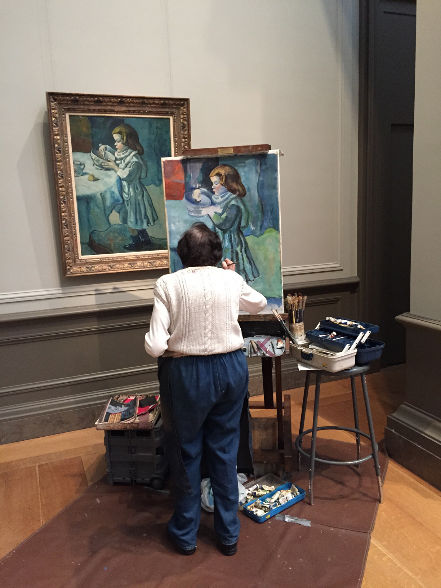

## Map signs      

### Semiotics 101  

Semiotics deals with the study of **signs** employed for representation. For cartography, I think it is helpful to review some of basic concepts of semiotics, not in an effort to dress up an artistic craft in academic jargon, but rather in an effort to understand different options for creating and employing signs in your creative work.  

Ferdinand de Saussure considered signs as the basic unit of meaning. He thought signs were composed of two parts:  

1. Something that serves as the **signifier**, or the form of sign. On maps, these tend to be things that we see. More generally, they include sounds, facial expressions, or other means of externalizing meaning.   

2. Something that serves as the **signified**, or the concept or object that is represented.

Charles Sanders Pierce (pronounced _purse_) considered concepts and referent objects as distinct things. This gives us the **semantic triangle** as the basic triad of representation that I introduced in our last meeting.        

According to Pierce, there are three categories of signifiers:  

1. An **icon** has a physical resemblance to the signified. On maps, this is often done through **metonymy**, using a part of something to signify the whole. Examples from maps include:  

  - A picture of a runway or airplane to signify an airport.  

  - A picture of a triangle to represent a mountain.

  - A picture of a building footprint to signify a building.  

  - A picture of a cross to signify a church.  

  - A picture of a star to signify a capitol (or the center of a system).  

2. An **index** shows evidence of what is being represented, or shows something that is directly influenced by the object/referent and cannot exist without it. For example, I think an animal track in the snow would be consider to be an index of an animal. On maps, the depiction of a magnetic needle to represent north is an example of an index. Indexes involve a level of inference and detective work that differs from reading icons, because indexes often show the effect to signify the cause.      

3. A **symbol** has no resemblance to the signified and must be culturally learned. Examples from maps include place names and labels (letters and numbers generally). Symbols also include **cartographic conventions**, or signs that have become standard practice to signify certain kinds of geographic features. Examples include the morse code (dash-dot-dot) style to represent political boundaries and ephemeral streams.     

Again, the value here for cartography is not to generate confusion about whether a north arrow in an icon or an index. Rather it is to encourage you to think about different methods for signifying something without words or numbers.

_You can show a picture that resembles the object or a part of the object directly. Or you can show a picture that resembles an effect of the object_.  

### Practice application: the campus map   

Take a look at Middlebury's [official campus map](https://www.middlebury.edu/system/files/media/printablenewmap.pdf).  

* What kinds of signs does the map employ?  

* Do you think this is effective?  

* What criteria are you using to evaluate the map's effectiveness?    

<b>Practice activity</b>

 
Take a few moments to create a sketch map of campus. Start by drawing the main roads to serve as reference features. Then rather than using icons or symbols to represent places, use index signs to represent how places on campus make you feel.

  

### Map signs and geometries  

Map icons and indexes are commonly associated with point features, but may also include lines and areal features.  

For example, look at this [USGS topo map of Middlebury](https://ngmdb.usgs.gov/topoview/viewer/#15/44.0121/-73.1817). What signs are used for point, line, and areal features?    

### Resources  

- [NPS Symbol Library](https://www.nps.gov/maps/tools/symbol-library/index.html)  

- [MAKI](https://labs.mapbox.com/maki-icons/)  

- [USGS map symbols](https://pubs.usgs.gov/gip/TopographicMapSymbols/topomapsymbols.pdf)  

- [Conventional signs for Swiss National Maps](https://www.swisstopo.admin.ch/content/swisstopo-internet/en/home/products/maps/national/lk25/_jcr_content/contentPar/tabs_copy_copy_copy/items/dokumente_publikatio/tabPar/downloadlist_copy_co/downloadItems/554_1466074737273.download/symbols_en.pdf)

### Project thoughts  

In the final week of your project, you should transition from data compilation to data styling. The playlist that will be available on Friday will illustrate methods to develop a style sheet and apply styles to your mapped geography.  

Some of you may be feeling some anxiety and want to know: what is the 'right ways' to style my map? I think the answer to this is that there is no single right way. Design involves considering alternative ways to solve the problem and then choosing a way that works given your purpose, audience, and constraints.  

Stephen Irwin (a professor at Harvard Graduate School of Design) put it this way. Consider these two sentences:  

- _The answer to a problem._

- _An answer to the problem._   

For Professor Irwin, the first sentence describes _analytic thinking_, while the second sentence describes _design thinking_.  

This is why I have tried to remind you to be clear about problem definition for your projects. (What is the purpose of your map? Who is your map for? What are your constraints?). Your problem needs to be well-defined in order to evaluate whether your solutions work or could work better.      

But there is also a strategy for coming up with solutions (and styles) that I have tried to encourage you to use. It starts with the understanding that you are not the first person to have to make a map and style the features on it. So you should try to identify how other people solved similar problems and then try to replicate their solutions.   

_From my experience teaching cartography as a creative process over the last ten years, the most successful student maps do two things: (1) keep the problem simple and (2) incorporate styles that are illustrated in good examples_.    

  

So I am sorry if I am repeating myself (I know I have shown the above picture previously), but I would like to remind you that you should look at good examples of maps for the ways that they style features that you need to style on your own map and then try to replicate their solutions in your own work.  

### On COVID and cartography  

One of the consequences of COVID is that it has pushed me to teach students geographic methods that can be done independent of a specific place. Prior to COVID, students had to go to a computer in the Geography Department to access the GIS and Adobe software that we used for cartography. Now I try to teach methods that remain accessible to students should they enter quarantine or should we be asked to abruptly leave campus (as has happened twice now).  

While there are many positive aspects of this (you can work more opportunistically, tinker more, and continue to work on maps when away from campus), it has also repressed the social dimension of learning that I think is very valuable. Cartography students used to work/suffer more together in the same space outside of a designated lab time, simply because they had to go to that space to work on their projects.   

I would like to be able to foster more of this social dimension to learning by using some class meeting time to have you share and compare your work with peers. One idea is that we can start to use regular 'check ins' as opportunities for you to learn from each other and not just as opportunities for me to give you written feedback on your work. But this would require you to have work ready for feedback by our lecture meeting on check in days. Do you think this is feasible? For the next project, can we officially set this as an expectation?   
