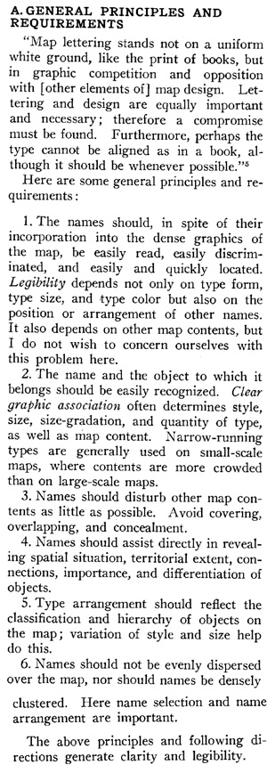

## Positioning names on maps  

Our goal today is to review principles for positioning names on maps as described by Eduard Imhof (1975). We will first review his principles, then interpret what represent good and poor examples of them, and then practice the serene art of lettering with a good example from National Geographic.  

### Imhof's general principles  

  

### Quality assessments      

Here are [examples](https://drive.google.com/drive/folders/1sR7-YR3vqsFHDspmiwapLX8axunh6Zal?usp=sharing) from Imhof (1975). Please pair up with a classmate as we talk through some of the examples.  

### The practice of lettering  

First, please watch a little of Daniel Huffman's video on [The Serene Practice of Map Labeling](https://www.youtube.com/watch?v=UWo12NFdxJ0). Take note of the Illustrator methods he employs.  

Second, please open this [Google drive](https://drive.google.com/drive/folders/1KMy5W4zOyZ925X3j_BerHOA_HN5u9Fap?usp=sharing) and download the AI file called **lettering-practice**. You should be able to open this file in Illustrator. It shows a clip of the Caribbean Sea from a National Geographic _World Atlas_.   

Please note that National Geographic uses a [proprietary typeface called Riddiford](http://luc.devroye.org/fonts-64560.html), which we do not have access to. Nevertheless, please draw the following labels directly on top of the image and try to mimic the type variables as close as possible (including the font, size, weight, and letter spacing) for the following names:  

* Caribbean Sea  
* Straits of Florida  
* Golfo de Venezuela    
* Honduras  
* Venezueala  
* Jamaica  
* Kingston  
* San Juan (PR)  
* Barbados  

Please consider:  

1. Where do the position of labels evidence Imhof's principles?  
2. Where do the position of labels break Imhof's principles and what are possible reasons that the cartographer broke them?  
3. In what ways do the type variables enforce a visual hierarchy to place names?  
