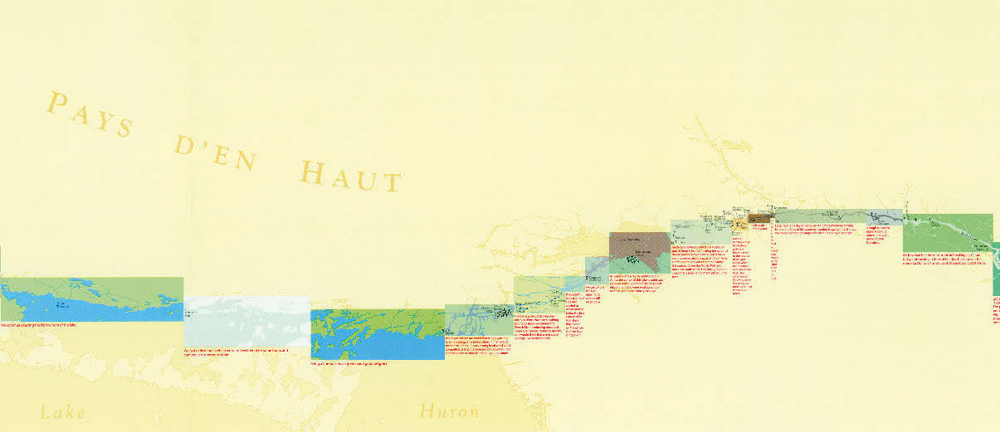
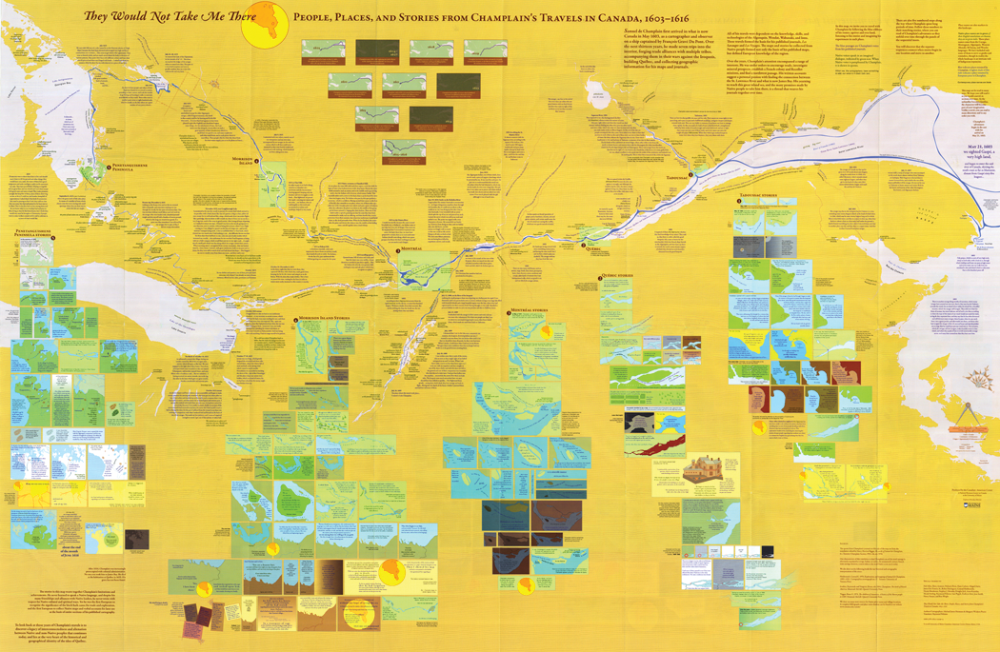
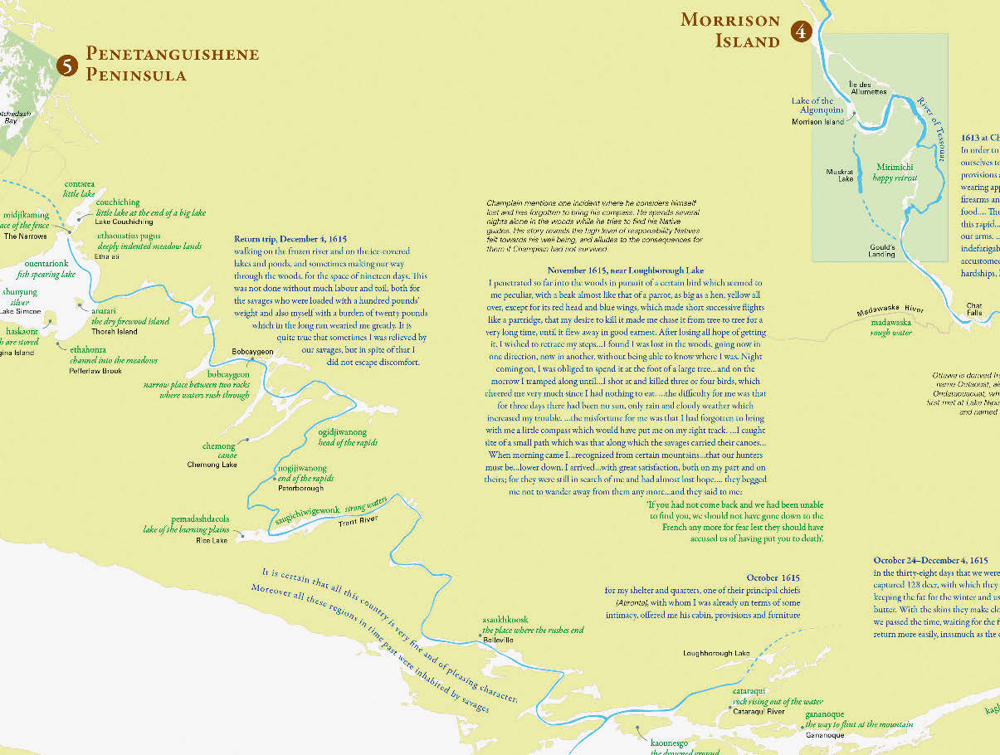
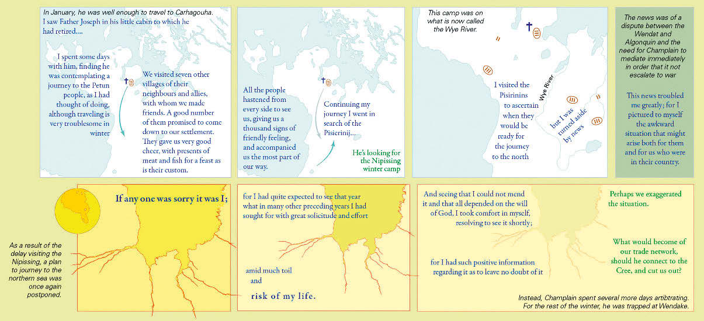
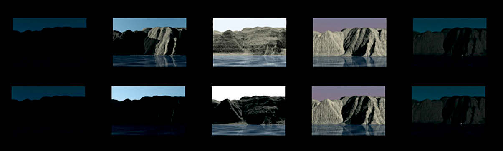
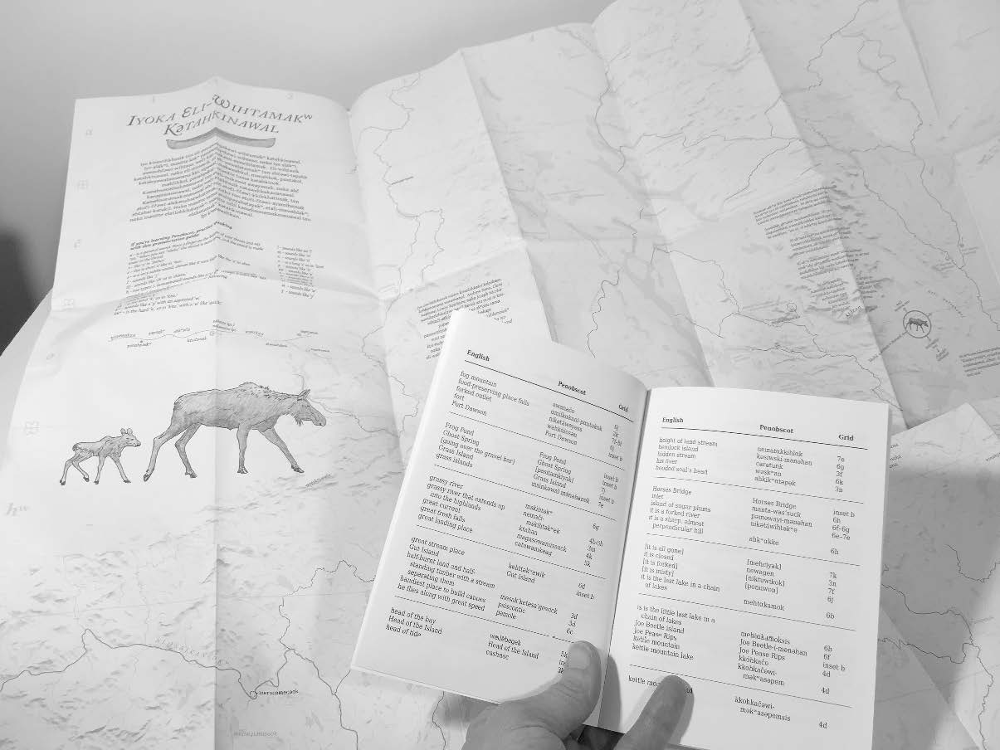
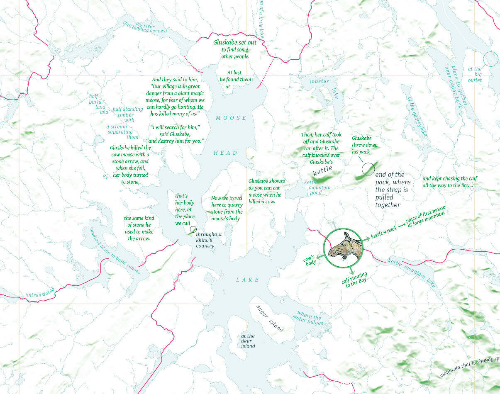
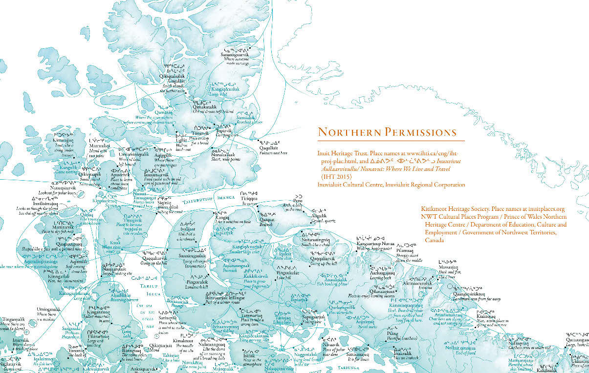

## What shall we map next?  

_Margaret Wickens Pearce_

Cartography mirrors traditional indigenous expression:    

- relationality  
- [mneumonic device](https://upload.wikimedia.org/wikipedia/commons/b/bf/Micronesian_navigational_chart.jpg)    
- situated narratives    

How can indigenous knowledge strengthen cartography?  

- The _things_ we put on a map, like palettes or symbols or other objects to place at locations on the map?  

- The _process_ of making maps (by incorporating Indigenous methodologies, pedagogies, and epistemologies)?  

## Reading Pearce's cartography  

For each map project below, please critique:  

- _What design elements (things on map) does she employ? (Use the [Cart Check list](https://geog0231.github.io/cartCheck/) as a guide.)_

- _What influences her design process?_  

### Journey of John Macdonell (2005)  

(320 - 321 in reading)

  

[_Framing the Days: Place and Narrative in Cartography_](http://humnviz.blogs.bucknell.edu/files/2015/08/Pearce_Framing-the-Days_Place-and-Narrative-in-Cartography.pdf)  

### Journeys of Champlain (2008)  

  

_What do the authors highlight in their [design narrative](https://cartographicperspectives.org/index.php/journal/article/view/cp66-hermann-pearce/pdf)?_

_What does Huffman praise/critique in [his review](https://cartographicperspectives.org/index.php/journal/article/view/cp71-huffman/html)?_

_In Pearce's later reflection on her work, what processes does she emphasize? (322-324)_  

_Her article does not include descriptive captions. What caption would you write for the two images below?_  

  

  

### Na Pali cliffs (2008)    

  

### Penobscot (2015)  

  

### Canada 150 (2017)  

  

### Cartographic Assumptions  

How does Pearce describe and confront these assumptions of cartography?  

- "the authentic past assumption"  
- "the technology assumption"  
- "inventory assumption"  
- "agreement assumption"  
- "scale up problem"  
- "linear time problem"  
- "boundary line problem"  

### Common threads  

Here is a short list of common threads in Pearce's work. 

- presence of situated stories   
- resistence to closure    
- incorporation of the reader into the narrative structure and story    
- agency of stories as portals to relational ontologies    
